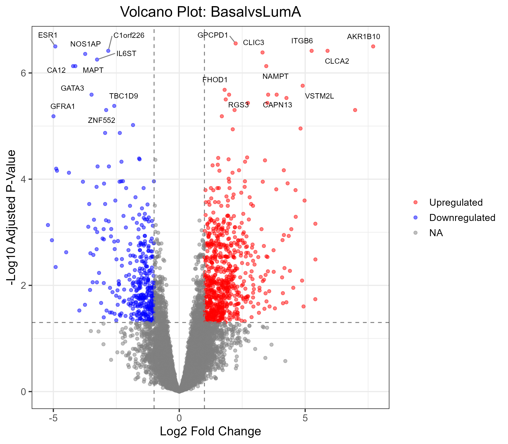

# Proteomic Analysis of CPTAC Prospective Breast Cancer Subtypes

## Introduction

This project performs a bioinformatics analysis of the Clinical Proteomic Tumor Analysis Consortium (CPTAC) Prospective Breast BI Proteome dataset (Krug et al., Cell 2020; PDC Study ID: PDC000120). The primary goal is to identify differentially expressed proteins and associated biological pathways between different breast cancer subtypes, primarily focusing on the comparison between Basal-like and Luminal A tumors, as defined by the PAM50 classification.

This analysis showcases skills in:
*   Data acquisition from public repositories (CPTAC)
*   Data wrangling and cleaning using R and tidyverse principles
*   Quality control assessment of proteomics data
*   Missing value imputation techniques (k-Nearest Neighbors)
*   Exploratory data analysis (Principal Component Analysis)
*   Statistical analysis for differential protein expression (`limma` package)
*   Data visualization (`ggplot2`, `pheatmap`)
*   Functional enrichment analysis (Gene Ontology, KEGG pathways using `clusterProfiler`)
*   Reproducible research practices (`renv`)

## Data

*   **Source:** CPTAC Data Portal (Study PDC000120) and supplementary materials from Krug et al., Cell (2020).
*   **Proteomics Data:** `prosp-brca-v5.4-public-proteome-ratio-norm-NArm.gct` - Contains TMT-based relative protein quantification data (log-ratios, normalized). Processed data derived from the publication supplements.
*   **Clinical/Annotation Data:** `prosp-brca-v5.4-public-sample-annotation.csv` - Contains rich sample annotations including PAM50 subtype, ER/PR/HER2 status, age, stage, etc. Sourced from publication supplements.

## Workflow / Methods

The analysis was performed using R (version 4.3) and RStudio, with package management handled by `renv`. The key steps included:

1.  **Setup:** Initialization of `renv` for package management.
2.  **Data Loading:** Reading the clinical CSV (`readr`) and proteomics GCT files (`cmapR`).
3.  **Data Alignment:** Ensuring clinical sample information correctly matched the columns (samples) in the proteomics matrix.
4.  **Quality Control (QC):**
    *   Initial inspection of data structures and identifiers.
    *   Visualization of sample abundance distributions (boxplots, density plots via `ggplot2`) to assess normalization.
    *   Assessment of missing values (NAs).
5.  **Missing Value Handling:**
    *   **Filtering:** Proteins with >50% missing values across samples were removed.
    *   **Imputation:** Remaining NAs were imputed using k-Nearest Neighbors (kNN) via the `impute` package.
6.  **Exploratory Data Analysis (EDA):** Principal Component Analysis (PCA) was performed (`prcomp`) on the processed (filtered and imputed) data, and results were visualized (`ggplot2`) colored by PAM50 subtype and ER status.
7.  **Differential Expression Analysis:** The `limma` package was used to identify proteins differentially expressed between PAM50 subtypes.
    *   A linear model was fitted using a design matrix based on PAM50 subtypes (`model.matrix`, `lmFit`).
    *   Contrasts were defined to compare specific groups (e.g., Basal vs. LumA) (`makeContrasts`, `contrasts.fit`).
    *   Empirical Bayes moderation (`eBayes`) was applied to improve statistical power and stability.
    *   Results tables were extracted (`topTable`).
8.  **Visualization of DE Results:**
    *   **Volcano Plot:** Generated using `ggplot2` and `ggrepel` to visualize log2 fold change vs. -log10 adjusted p-value for the Basal vs. LumA comparison.
    *   **Heatmap:** Generated using `pheatmap` to visualize the expression patterns of the top 50 differentially expressed proteins (Basal vs. LumA) across all relevant samples, with clinical annotations.
9.  **Functional Enrichment Analysis:** Gene Ontology (GO) and KEGG pathway enrichment analyses were performed on lists of significantly differentially expressed genes using `clusterProfiler` and `org.Hs.eg.db`. Gene symbols were mapped to Entrez IDs. Results were visualized using dot plots (`ggplot2`).

## Key Results

### Quality Control & Preprocessing
*   Initial visualization showed the proteomics data was well-normalized across samples.
*   Approximately 5.3% of values were initially missing. Filtering removed [Number] proteins quantified in less than 50% of samples.
*   Remaining missing values (~4.0%) were imputed using kNN, resulting in a complete matrix (`proteomics_matrix_processed`) with [Number] proteins and [Number] samples for downstream analysis.

### Exploratory Data Analysis (PCA)
Principal Component Analysis on the processed data showed clear separation between samples based on their PAM50 subtypes, particularly along PC1 and PC2, indicating strong underlying biological differences captured in the proteome. Separation by ER status was also observed, correlating with PAM50 classification.

*Caption: PCA of samples based on filtered and imputed protein expression, colored by PAM50 subtype.*

*Optional: Include ER Status PCA if generated*

*PCA of samples, colored by ER Status.*

### Differential Expression (Basal vs. LumA Example)
Differential expression analysis between Basal and Luminal A subtypes (using FDR < 0.05 and |log2 Fold Change| >= 1.0) identified **[Number]** significantly upregulated proteins in Basal samples and **[Number]** significantly downregulated proteins (i.e., upregulated in LumA).

*Volcano plot showing log2 fold change vs. -log10 adjusted p-value for Basal vs. LumA comparison. Red points are significantly upregulated in Basal; blue points are significantly downregulated.*

### Heatmap Visualization
A heatmap of the top 50 differentially expressed proteins clearly clustered Basal and LumA samples separately.

*Heatmap of the top 50 DE proteins (Basal vs LumA). Rows are proteins (Z-score scaled), columns are samples. Annotation bars show PAM50 subtype and ER status.*

*   **Observations:** Distinct blocks of proteins showed higher expression in Basal samples (enriched for ECM/wound healing functions) versus LumA samples. Key luminal markers like ESR1, GATA3, and FOXA1 showed higher expression in LumA samples, as expected. Sample clustering correlated well with ER status annotation (Basal mostly ER-, LumA mostly ER+).

### Functional Enrichment Analysis

*   **Upregulated in Basal (vs. LumA):** GO Biological Process analysis revealed significant enrichment for terms related to **extracellular matrix organization, wound healing, cell-substrate adhesion, and coagulation cascades**. This aligns with the known invasive and microenvironment-interacting properties of Basal-like tumors.

    
    *GO Molecular Function enrichment for proteins upregulated in Basal vs. LumA.*

*   **Downregulated in Basal (Upregulated in LumA):** GO Molecular Function analysis showed strong enrichment for **DNA-binding transcription factor activity**, particularly related to RNA Polymerase II cis-regulatory regions. This reflects the transcriptionally driven, differentiated state often seen in Luminal A tumors.

    
    *GO Molecular Function enrichment for proteins downregulated in Basal vs. LumA.*

*   **KEGG Pathway Analysis (All DE Genes):** Analysis using all DE genes highlighted **Complement and coagulation cascades** as the most significant pathway, along with pathways related to **actin cytoskeleton regulation, steroid hormone biosynthesis, and platelet activation**.

    
    *KEGG Pathway enrichment for all differentially expressed proteins (Basal vs. LumA).*

## Discussion & Conclusion

This analysis successfully processed and analyzed CPTAC prospective breast cancer proteomics data to reveal distinct protein signatures associated with Basal and Luminal A subtypes.

*   Proteins more abundant in **Basal-like tumors** are significantly enriched in pathways related to ECM remodeling, wound healing, coagulation, and cell adhesion/cytoskeleton regulation, consistent with their typically more aggressive and mesenchymal phenotype.
*   Proteins more abundant in **Luminal A tumors** are highly enriched for transcription factor activity, reflecting their hormone-receptor driven, differentiated state, exemplified by the high expression of ESR1, GATA3, and FOXA1 observed in the heatmap.
*   These findings confirm known biological distinctions at the protein level and provide specific protein candidates and pathways for further investigation as potential biomarkers or therapeutic targets.

## Technologies & Packages Used

*   **Language:** R (4.3)
*   **Environment:** RStudio
*   **Package Management:** `renv`
*   **Core Packages:**
    *   `tidyverse` (incl. `readr`, `dplyr`, `tidyr`, `ggplot2`)
    *   `cmapR` (GCT file parsing)
    *   `impute` (kNN imputation)
    *   `limma` (Differential expression)
    *   `pheatmap` (Heatmap generation)
    *   `RColorBrewer` (Color palettes)
    *   `ggrepel` (Volcano plot labels)
    *   `clusterProfiler` (GO/KEGG enrichment)
    *   `org.Hs.eg.db` (Human genome annotation)

## Contact

[Link portfolio website or LinkedIn profile]
